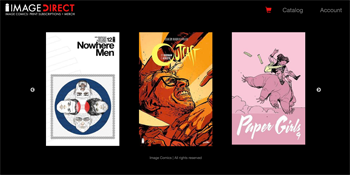

#Image Comics Ecommerce App

##Overview
* Ecommerce site built with Node.js, Express, MongoDB, and AngularJS. Full Stack Mean.
* Front-end is entirely Angular.js, HTML, and CSS
* Back-end is an api driven by Express and MongoDB in Node.js.
* Users can register an account, login and add their favorite Image comics to their shopping cart.
* They can then checkout adding their shipping information and order to the MongoDB.

### Technologies, frameworks, & programming Languages used
* HTML5 & CSS3
* Sass
* JavaScript
* AngularJS
* Node.js
* Express
* MongoDB
* Mongoose

###[Demo](http://www.danielbarranco.com/imagecomics/#/)